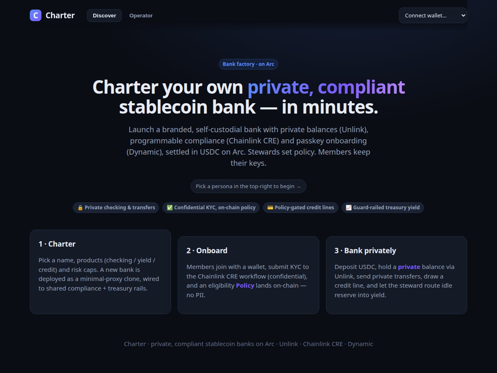

# BankOS 🏦

**Charter your own private, compliant, self-custodial stablecoin bank on Arc — in minutes.**

BankOS is a *bank factory*: infrastructure that lets any operator ("steward") launch a branded,
rule-based stablecoin bank with **private balances** (Unlink), **programmable compliance**
(Chainlink CRE), and **passkey onboarding** (Dynamic), settled in USDC on **Arc**. Members keep their
own keys; the steward configures policy, never custody.

> Not an FDIC-insured deposit bank. BankOS is *banking infrastructure* / self-custodial bank rails.



---

## The idea

Community banking is dying while the need grows. The primitives to rebuild it now exist — BankOS
composes them into one stack: **social trust on top, cryptographic guard-rails underneath.**

| Layer | Sponsor | Role in BankOS |
|---|---|---|
| **Private balances & transfers** | **Unlink** | Members' checking balances and transfers live off the public ledger; treasury moves are shielded. |
| **Compliance / policy** | **Chainlink CRE** | Confidential KYC / sanctions / eligibility in a TEE; only the *decision* (`Policy`) is attested on-chain. |
| **Onboarding UX** | **Dynamic** | Passkey embedded wallets — members join a bank without installing MetaMask. |
| **Settlement** | **Arc** | USDC-native L1; balances, fees, and credit denominated in dollars. |
| **Treasury routing** *(stretch)* | **LI.FI** | Same-chain Arc swap-calldata **preview** for idle-reserve routing (execution through the Unlink burner is not yet wired) — feature-flagged (see [ADR-001](docs/ADR-001-lifi-poc.md)). |

## What's built

- **5 core contracts** + 2 mocks on solady — `CharterFactory · Bank · PolicyRegistry · ExecutionRouter
  · PrivacyPool`. **40/40 Foundry tests pass.** Deployed to local Anvil **and live on Arc testnet**
  (chainId 5042002; addresses in `packages/contracts/deployments/5042002.json`).
- **Chainlink CRE compliance** — a real CRE workflow that **runs under `cre workflow simulate`**
  (compiles to WASM, HTTP-triggered screening, `Confidential HTTP → writeReport → PolicyRegistry.onReport`),
  *and* a local DON simulator that lands real on-chain attestations. The workflow is **not yet deployed to
  a live DON**.
- **Unlink privacy** — real `@unlink-xyz/sdk` account cryptography (`unlink1…`, EdDSA, poseidon) and real
  on-chain `PrivacyPool` deposit/withdraw on Arc. The shielded ledger between shield and withdraw is **our
  in-memory emulator** (hosted on Fly); the browser uses `LocalUnlinkClient` against that emulator, **not**
  Unlink's production hosted engine. CLI demo proves **shield → private transfer (hidden) → withdraw**.
- **Dynamic-powered web app** — operator console, member app, steward treasury desk. **Passkey embedded-wallet
  onboarding is enabled in the hosted production deployment** (`VITE_DYNAMIC_ENVIRONMENT_ID` set); runs offline
  with local personas when that env var is absent.
- **10 product features shipped** (`docs/FEATURES.md`) including recurring private payroll, selective-disclosure
  bank-signed statements, reputation-based credit, inter-bank settlement, and EURC/FX in the shielded ledger.
- **LI.FI PoC** — verified same-chain Arc routing-calldata; shipped as a feature-flagged *route-preview* module
  (calldata preview only; burner execution not wired). Not submitted as a sponsor integration.

## Quick start

```bash
npm install
bash scripts/demo.sh          # boots anvil, deploys, starts CRE + Unlink services, seeds, runs the app
# → open the printed web URL; pick a persona top-right
bash scripts/demo.sh stop     # tear down
```

Or run pieces individually:

```bash
npm run chain                 # local Arc (anvil) on :8545
npm run deploy:local          # deploy + write deployments/31337.json
npm run abis                  # export ABIs to shared
npm run -w @bankos/cre-policy dev      # Chainlink CRE policy service (:4001)
npm run -w @bankos/unlink-engine dev   # Unlink engine (:4002)
npm run seed                  # charter a demo bank, onboard members, deposit, credit, yield
npm run web:dev               # the app
```

Standalone proofs:

```bash
npm run verify                            # Foundry tests + vitest + web typecheck + web build, one command
npm run lifi:poc                          # LI.FI Arc routing feasibility (ADR-001)
npm run -w @bankos/unlink-engine demo    # shield → private transfer → withdraw (privacy proof)
npm run contracts:test                    # 40 Foundry tests
npm run test:unit                         # 48 vitest tests (cre-policy + unlink-engine)
bash scripts/verify-arc.sh                # key-free Arc read-back proof (on-chain PrivacyPool.relayer() + Fly health)
```

> Running the privacy demo standalone? Make sure the engine isn't serving a **stale deployment**: run
> `bash scripts/demo.sh stop` first, or just use `bash scripts/demo.sh` (it always starts from a clean
> deployment and verifies each service's `/info/environment` matches before proceeding).

## Demo flow (90 seconds)

1. **Steward** persona → *Operator* → charter "Brooklyn Mutual" (pick products + risk caps).
2. **Dave (new member)** → open the bank → *Compliance* → submit KYC → the Chainlink CRE workflow
   approves and an eligibility `Policy` is attested on-chain. (Try `country=KP` for a sanctions reject.)
3. Dave deposits USDC (public checking) and **sets up a private account** → shields USDC → sends a
   **private transfer** to another member (off-chain, hidden) → withdraws to a fresh address.
4. **Steward desk** → open a credit line for a member, then route idle reserve into the allow-listed
   yield vault — utilization and treasury guard-rails enforced on-chain.

## Going to Arc testnet / production

- Deploy with `USDC_ADDRESS=0x3600…0000` (Arc's canonical USDC) and `--rpc-url https://rpc.testnet.arc.network`.
- Real onboarding: set `VITE_DYNAMIC_ENVIRONMENT_ID` (Dynamic dashboard, with Arc configured).
- Real privacy: set `UNLINK_ENGINE_URL` + `UNLINK_API_KEY` (hosted Unlink engine) → `LiveUnlinkClient`.
- Real compliance: `cre workflow simulate packages/cre-policy/workflow` then let Chainlink deploy it;
  authorize the DON forwarder via `PolicyRegistry.setAttester(forwarder, true)`.

## Repo layout

```
packages/
  contracts/      Foundry — 5 contracts, mocks, 40-test suite, deploy script
  shared/         Arc chain config, exported ABIs, shared TS types
  cre-policy/     Chainlink CRE workflow + local DON simulator (attester) + seed
  unlink-engine/  Unlink engine emulator + real-SDK client (Local + Live) + privacy demo
  web/            Vite + React app (Dynamic onboarding, operator/member/steward UIs)
scripts/          lifi-poc · export-abis · sync-web · demo.sh
docs/             ARCHITECTURE.md · ADR-001 (LI.FI) · screenshots
```

## Docs

- [`docs/ARCHITECTURE.md`](docs/ARCHITECTURE.md) — layers, contracts, and end-to-end flows.
- [`docs/ADR-001-lifi-poc.md`](docs/ADR-001-lifi-poc.md) — the LI.FI proof-of-concept + decision.
- Per-package READMEs in `packages/*/README.md`.
